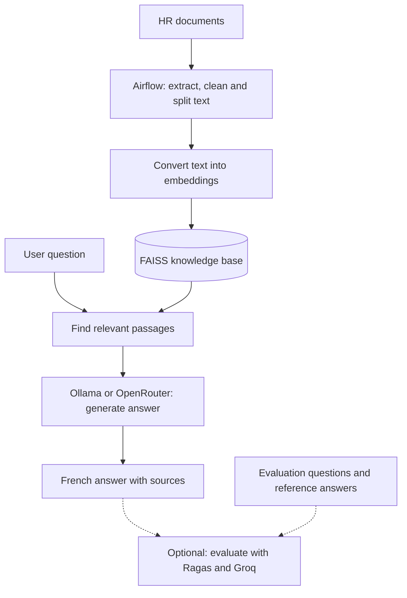

# Safran HR Chatbot

Developed a Safran-focused HR chatbot using Retrieval-Augmented Generation (RAG)
during **Tink to Deploy**, a national hackathon organized by the **CIT INPT Club**.

The chatbot answers HR questions in French using information retrieved from local
documents. It combines an automated document pipeline, a web chat interface, and
an optional evaluation workflow.

## Project workflow



1. **Prepare documents:** Airflow extracts text, masks personal information, and builds the FAISS index.
2. **Answer questions:** FastAPI retrieves relevant passages and sends them to the language model.
3. **Evaluate quality:** Ragas compares chatbot outputs against reference answers using a Groq judge.

## Technology stack

| Component | Technology |
| --- | --- |
| Web application | FastAPI, HTML and Jinja2 |
| Document pipeline | Apache Airflow |
| Embeddings | Sentence Transformers, multilingual MiniLM |
| Vector search | FAISS |
| Answer generation | Ollama or OpenRouter |
| Evaluation | Ragas and Groq |
| Deployment | Docker Compose; PostgreSQL for Airflow metadata |

## Project structure

```text
rag_core/           Ingestion, retrieval, generation, API and CLI
frontend_chatbot/   Chat templates and static assets
dags/               Airflow ingestion DAG
dataset/            Local HR documents
pipeline_work/      Generated ingestion checkpoints and reports
evaluation/         Evaluation runner, dataset and saved results
tests/              Unit, regression and container integration tests
init_airflow.py     Airflow database and operator initialization
Dockerfile          API, Airflow and evaluation build targets
docker-compose.yaml Services, networks and persistent volumes
requirements.txt    Shared Python dependencies
.env                Local configuration and credentials
```

Source documents, generated results, and `.env` are excluded from Git.
Run the commands below from the project root.

## Getting started

### 1. Prepare documents and configuration

Start Docker Desktop with Linux containers. Place your HR documents in `dataset/`.
Supported formats: **PDF, DOCX, DOC, XLSX, XLS, TXT and Markdown**, including scanned
PDFs through OCR.

Configure the root `.env` with your preferred provider. For local generation:

```dotenv
LLM_PROVIDER=ollama
OLLAMA_MODEL=qwen3:4b
OLLAMA_URL=http://host.docker.internal:11434/api/generate
```

Download the model and ensure Ollama is running on the host:

```sh
ollama pull qwen3:4b
ollama serve
```

If Ollama is already running, skip `ollama serve`. To use OpenRouter, set
`LLM_PROVIDER=auto`, `OPENROUTER_API_KEY`, and `OPENROUTER_MODEL` in `.env`.
In this mode, generation falls back to Ollama if OpenRouter fails.

### 2. Start the services

```sh
docker compose up -d --build
```

| Interface | Address | Access |
| --- | --- | --- |
| Chatbot | http://localhost:8000 | No login |
| API documentation | http://localhost:8000/docs | No login |
| Airflow | http://localhost:9080 | Default: `admin` / `admin` |

Airflow credentials can be configured with `AIRFLOW_ADMIN_USER` and
`AIRFLOW_ADMIN_PASSWORD`. Initial builds and model downloads may take time.

### 3. Build the knowledge base

Trigger the ingestion DAG from Airflow or run:

```sh
docker compose exec airflow-scheduler airflow dags trigger safran_robust_faiss_rag_pipeline
```

The DAG also runs daily. Once ingestion completes, open the chatbot and ask a
question. Before a nonempty index is available, questions return HTTP 503.

## Configuration

Docker Compose reads the single root `.env` file automatically. Preserve existing
credentials when editing it.

| Variable | Purpose / default |
| --- | --- |
| `LLM_PROVIDER` | `ollama`, or `auto` for OpenRouter with fallback |
| `OLLAMA_MODEL` | Local model: `qwen3:4b` |
| `OLLAMA_URL` | Docker host endpoint: `http://host.docker.internal:11434/api/generate` |
| `OPENROUTER_API_KEY` | Optional hosted generation credential |
| `OPENROUTER_MODEL` | `mistralai/mistral-small-3.2-24b-instruct` |
| `EMBEDDING_MODEL` | `paraphrase-multilingual-MiniLM-L12-v2` |
| `AIRFLOW_ADMIN_USER` / `AIRFLOW_ADMIN_PASSWORD` | Initial Airflow operator account |
| `AIRFLOW_WEBSERVER_SECRET_KEY` | Airflow webserver signing key |
| `GROQ_API_KEY` | Evaluation judge credential |
| `GROQ_MODEL` | Evaluation model: `openai/gpt-oss-120b` |

## Evaluation

Evaluation is optional and does not start with the normal stack. It uses
`evaluation/test_dataset.json` and the running chatbot API. **Groq judges answers;
Ollama or OpenRouter generates them.** Reference answers are never sent to the chatbot.

Build the evaluator and collect answers without judge calls:

```sh
docker compose build rag-evaluation
docker compose run --rm --no-deps rag-evaluation --collect-only --output /evaluation/results/baseline
```

Set `GROQ_API_KEY` in `.env`, then score the saved answers:

```sh
docker compose run --rm --no-deps rag-evaluation --answers-from /evaluation/results/baseline --output /evaluation/results/groq
```

For batches of ten questions, append `--next-batch` to the scoring command and
repeat for each unfinished batch. Reruns reuse saved answers and successful scores.
Use a new output directory when changing the dataset, index, or judge. Only one
process should write to an output directory at a time.

| Output in `evaluation/results/<run>/` | Contents |
| --- | --- |
| `records/` | Answers, retrieved passages, scores and errors |
| `scores.csv` | Per-question metric scores |
| `summary.json` | Aggregate scores, sample counts and failures |
| `metadata.json` | Dataset, index and model information |
| `batches.json` | Batch membership and scoring progress |
| `ragas_inputs.jsonl` | Collected inputs for evaluation |

Metrics include context precision, context recall, faithfulness, response
relevancy and factual correctness. Unanswerable questions are evaluated separately
for appropriate abstention. Inspect errors, missing sources and sample counts
before interpreting averages; blank scores are not zeros.

## Development and tests

Use **Python 3.11**. On Windows PowerShell:

```powershell
py -3.11 -m venv .venv
.venv/Scripts/python -m pip install -r requirements.txt
.venv/Scripts/python -m unittest discover -s tests -v
```

The unit and regression tests use deterministic embeddings and require no model
download or paid API calls. To run the full ingestion smoke test inside Docker:

```powershell
docker compose run --rm --no-deps -v "${PWD}/tests:/tests:ro" airflow-scheduler python /tests/container_smoke.py
```

This integration test uses temporary documents, real OCR and embeddings, and a
stubbed answer generator. It does not modify the published knowledge base.

For local development, activate the virtual environment and run:

```sh
python -m rag_core serve
python -m rag_core status
python -m rag_core ask "Quelle est la politique de cong?s ?"
```

Local commands read shell environment variables; they do not load `.env`
automatically. They use `rag_index/` by default, independently of Docker's volume.
To inspect the Docker index, run `docker compose exec fastapi python -m rag_core status`.

## API and troubleshooting

| Endpoint | Purpose |
| --- | --- |
| `GET /` or `/chatbot` | Chat interface |
| `POST /api/ask` | Question, answer and source metadata |
| `GET /api/status` | Published index metadata |
| `GET /health` | Process health and index status |
| `GET /ready` | Index availability; does not test the LLM |
| `GET /docs` | Interactive API reference |

```sh
docker compose config --quiet
docker compose ps
docker compose logs --tail=100 airflow-init airflow-scheduler fastapi
docker compose exec airflow-scheduler airflow dags list-import-errors
```

- **HTTP 503:** check documents and ingestion status; the index may be unavailable or empty.
- **HTTP 502:** check the generation provider, model and credentials.
- **Force reprocessing:** trigger the DAG with `{"force_rebuild": true}` in Airflow.
- **Change embedding model:** recreate Airflow containers and rebuild the index.

## Design notes and limitations

- Documents are split into 1,000-character chunks with 200-character overlap; retrieval returns up to five passages.
- Unchanged corpora skip ingestion. Document changes trigger a rebuild; failed ingestion preserves the last published index.
- Index snapshots are immutable and published atomically. The API loads updates on the next question.
- Limits are 50 MB per source file and 5,000 chunks per corpus. PPTX is not supported.
- Personal-information masking uses regular expressions and is incomplete. Retrieved sources and judge scores do not guarantee correct answers.
- The chat has no authentication and does not persist conversations. Docker binds web interfaces to localhost; PostgreSQL stores Airflow metadata.
- Intermediate files, index snapshots and evaluation results are retained for inspection; automatic cleanup is not implemented.
