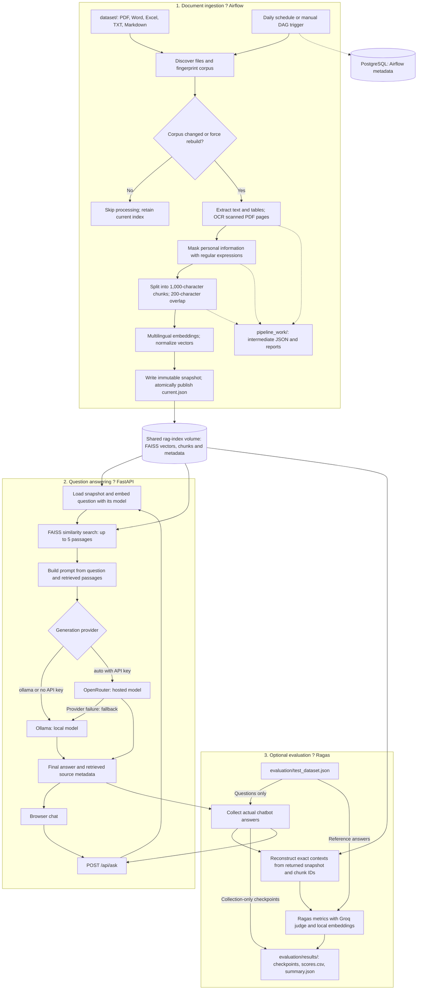

# HR Document Assistant ? RAG Chatbot

A French-language HR assistant using FastAPI, Airflow, FAISS and Ollama or
OpenRouter, with a resumable Ragas evaluation workflow.
Employees open the chat directly; there are no LDAP services, accounts, JWTs, or
session cookies in the application. Airflow retains its own operator login.

## Run with Docker

1. Start Docker Desktop with Linux containers.
2. Put your HR documents in `dataset/` (subfolders are supported).
   Supported formats: PDF, DOCX, DOC, XLSX, XLS, UTF-8 TXT and Markdown.
3. Configure the root `.env` file. Do not replace
   an existing API key. By default `LLM_PROVIDER=ollama` keeps generation local.
   Run Ollama on the host with `ollama pull qwen3:4b` and `ollama serve`.
   To use OpenRouter first, set `LLM_PROVIDER=auto`, `OPENROUTER_API_KEY`, and a model
   available to your account. Existing API keys are ignored in Ollama-only mode.
   On Docker Desktop, the API reaches the host through `host.docker.internal`.
4. Build and start:

   ```sh
   docker compose up -d --build
   ```

5. Open the chat at http://localhost:8000. Until ingestion completes, the page
   reports that documents are unavailable and questions receive a useful 503 error.
6. Open Airflow at http://localhost:9080 (default operator account: `admin` / `admin`).
   Trigger `safran_robust_faiss_rag_pipeline`, or use:

   ```sh
   docker compose exec airflow-scheduler airflow dags trigger safran_robust_faiss_rag_pipeline
   ```

The DAG is unpaused by default and scheduled daily. Initial builds download Python,
OCR and CPU PyTorch dependencies. The first ingestion and first question also
download the embedding model into persistent caches. Model generation requires
either a working OpenRouter account/model or a reachable Ollama instance.

## Project workflow

The workflow has three parts: scheduled document ingestion, question answering,
and optional evaluation. The diagram renders in GitHub and Mermaid-enabled
Markdown previews.



Airflow prepares the knowledge base before questions can be answered. The API
reads the published index and generates an answer from retrieved passages.
Evaluation sends questions through that same API, then scores the saved answers;
reference answers are supplied only to the judge. Groq is the evaluation provider,
while Ollama or OpenRouter generates the chatbot's answers.

### Index publication and reliability

The API uses the model recorded by the pipeline, avoiding embedding mismatches.
The default is `paraphrase-multilingual-MiniLM-L12-v2`. Changing `EMBEDDING_MODEL`
requires recreating the Airflow containers and running ingestion again. The API
reloads a new snapshot on the next question without a restart.

Unchanged corpora skip processing. Changed or deleted documents trigger a full
rebuild from the remaining files. Removing all documents publishes an empty
snapshot so deleted content cannot continue to appear in answers. A parsing or
indexing failure leaves the last successful index available; input files are never
moved or deleted. The corpus limit is 5,000 chunks and each source file is limited
to 50 MB. Exceeding a limit fails the run instead of silently omitting content.

To recreate intermediate files for an unchanged corpus, trigger the DAG manually
with `{"force_rebuild": true}` as its configuration. This preserves the normal
idempotent behavior of scheduled runs.

Airflow passes only working-directory paths through XCom. Intermediate JSON files
and reports live in `pipeline_work/` on the host; vectors and
matching chunks live on `rag-index`.
PostgreSQL holds Airflow metadata, not chat history. Old index snapshots and working
files are retained for debugging; this demo does not automatically prune them.

PII masking uses regular expressions and is not complete anonymization. Source
filenames remain visible in citations. Answers are generated from retrieved text;
the UI lists retrieved sources, which are not a claim that every answer is correct.
The chat does not persist conversations. The separate evaluation runner saves
measured scores and checkpoints under `evaluation/results/`.

## Configuration and endpoints

Configure provider, embedding-model and Airflow operator settings in the root `.env`.
Compose defaults are declared in `docker-compose.yaml`.
The root `.env` is the only environment file and is ignored by Git. Docker
Compose reads it automatically; local Python commands require environment
variables to be set in the shell.

| Variable | Purpose / Compose default |
| --- | --- |
| `LLM_PROVIDER` | `ollama`; use `auto` for OpenRouter with Ollama fallback |
| `OLLAMA_MODEL` | `qwen3:4b` |
| `OLLAMA_URL` | `http://host.docker.internal:11434/api/generate` |
| `OPENROUTER_API_KEY` | Hosted generation credential; optional in Ollama mode |
| `OPENROUTER_MODEL` | `mistralai/mistral-small-3.2-24b-instruct` |
| `EMBEDDING_MODEL` | `paraphrase-multilingual-MiniLM-L12-v2` |
| `AIRFLOW_ADMIN_USER` / `AIRFLOW_ADMIN_PASSWORD` | Initial operator account; defaults to `admin` / `admin` |
| `AIRFLOW_WEBSERVER_SECRET_KEY` | Airflow webserver signing key |
| `GROQ_API_KEY` | Evaluation judge credential; unnecessary for collection-only runs |
| `GROQ_MODEL` | `openai/gpt-oss-120b` |

Docker binds the web interfaces to localhost. The API is intentionally open to
anyone who can reach its port.

| Endpoint | Purpose |
| --- | --- |
| `GET /` or `/chatbot` | Chat without login |
| `POST /api/ask` | JSON question; answer and source metadata |
| `GET /api/status` | Published index metadata |
| `GET /health` | Process liveness and index status |
| `GET /ready` | 200 when index artifacts exist and contain chunks, otherwise 503 |
| `GET /docs` | Interactive API documentation |

Readiness reports index availability; it does not make a paid LLM request or
download the embedding model. Provider errors are returned as 502, and unavailable
retrieval as 503. Actual loading checks vector dimensions and chunk alignment.

## Validation and troubleshooting

```sh
docker compose config --quiet
docker compose ps
docker compose logs --tail=100 airflow-init airflow-scheduler fastapi
docker compose exec airflow-scheduler airflow dags list-import-errors
```

The regression tests use real FAISS with deterministic embeddings, so tests do not
need an API key or model download. Use Python 3.11:

```sh
py -3.11 -m venv .venv
# Windows PowerShell
.venv/Scripts/python -m pip install -r requirements.txt
.venv/Scripts/python -m unittest discover -s tests -v
```

For an integration test inside Docker (PowerShell, from the repository root):

```powershell
docker compose run --rm --no-deps -v "${PWD}/tests:/tests:ro" airflow-scheduler python /tests/container_smoke.py
```

This test creates temporary synthetic TXT, DOCX, XLSX and scanned PDF documents,
runs the real Airflow DAG and embedding model, and checks retrieval and citations.
It uses isolated index files and a stubbed answer generator; it does not publish
sample policies into the chat's knowledge base or make paid LLM calls.

## Project layout and local commands

```text
Dockerfile                  API, Airflow and evaluation build targets
requirements.txt            Shared dependency pins for the entire project
.env                        Local configuration and credentials (ignored by Git)
rag_core/                   Retrieval, generation, ingestion, web app and CLI
frontend_chatbot/            HTML templates and static assets
dags/                       Airflow pipeline definition
evaluation/                 Ragas runner and evaluation dataset
dataset/                    Your source documents (ignored by Git)
pipeline_work/              Ingestion checkpoints and reports (ignored by Git)
init_airflow.py              Airflow database and operator initialization
tests/                      Pipeline, answer, evaluation and container tests
docker-compose.yaml         Service configuration and persistent volumes
```

The API uses `rag_core.web:create_app` as its single application factory.
For local development, install the root `requirements.txt` with Python 3.11,
then run these commands from the repository root:

```sh
python -m rag_core serve
python -m rag_core status
python -m rag_core ask "Quelle est la politique de congés ?"
```

Local commands read environment variables and default to the local `rag_index/`
directory; they do not automatically load `.env` or Docker's index volume.
To query the running Docker index, use
`docker compose exec fastapi python -m rag_core status` from the repository root.

Compose waits for PostgreSQL health and successful database initialization before
starting Airflow. The Airflow build target pins the installed Airflow version to
the version supplied by its base image.

## Shared project configuration

Run Docker commands from the repository root. This project has one README,
one Git ignore file, one dependency list, one Compose file and one Dockerfile.
The Dockerfile has `api`, `airflow` and `evaluation` targets. All targets install
the shared dependencies; this favors a single install command over smaller images.
Airflow itself remains pinned to its base-image version in the Airflow target.
The evaluation service uses the `evaluation` profile and is started explicitly
with `docker compose run`; normal startup does not launch evaluations.

## Ragas evaluation

The evaluator runs the actual chatbot HTTP endpoint with `evaluation/test_dataset.json`.
It reconstructs the exact ordered prompt passages from the returned source/chunk
identifiers and immutable index version. References are never sent to the chatbot.
Groq is used only as the evaluation judge; the chatbot keeps its own model.
The judge receives questions, reference answers, chatbot answers and retrieved text.

If judge authentication is unavailable, collect locally first:

```powershell
docker compose build rag-evaluation
docker compose run --rm --no-deps rag-evaluation --collect-only --output /evaluation/results/baseline
```

After collection finishes, correct `GROQ_API_KEY` in `.env`
and score the saved collection with the `--answers-from` command below.
To resume collection, rerun the collection command with the same output directory. Create a new
container with `docker compose run` after changing credentials; `docker start`
on an old container retains its old environment. Only one process can write a
given output directory at a time.

From the repository root, with the normal stack already running:

```powershell
docker compose build rag-evaluation
docker compose run --no-deps rag-evaluation --output /evaluation/results/groq
```

The root `.env` is the only environment file. Set `GROQ_API_KEY` and
`GROQ_MODEL=openai/gpt-oss-120b` there for scoring. Collection-only runs do not
require a judge API key.

The Compose configuration reads `GROQ_API_KEY` and `GROQ_MODEL` from the ignored
`.env` file. The selected judge is `openai/gpt-oss-120b`, hosted
by Groq at `https://api.groq.com/openai/v1`. Never place keys in the dataset.
Provider account rate limits and pricing apply.
The runner spaces judge requests by 20 seconds, retries transient failures, and
uses separate requests for Ragas's multiple relevancy samples because Groq accepts
only one completion per request. A full evaluation can take several hours.
Collection-only resumes ignore judge settings because collection makes no judge calls.

To score the existing baseline collection while it continues running:

```powershell
docker compose run --no-deps rag-evaluation --answers-from /evaluation/results/baseline --output /evaluation/results/groq
```

This waits for each saved answer and does not regenerate it. Collection and scoring
must use separate output directories. Stop the scoring container if collection
is abandoned, since it waits for missing records.

For a small independent smoke test:

```powershell
docker compose run --no-deps rag-evaluation --limit 2 --output /evaluation/results/smoke
```

For the 90-question dataset, run nine batches of ten using the same judge and
the existing output directory. After quota is available, run:

```powershell
docker compose run --rm --no-deps rag-evaluation --answers-from /evaluation/results/baseline --output /evaluation/results/groq --next-batch
```

Each invocation runs only the first unfinished batch and then exits. Repeat after
checking quota; do not launch nine jobs in parallel. Use `--batch 1` through
`--batch 9` instead of `--next-batch` to select a specific batch. Existing successful
metrics (including zero scores) are reused. `scores.csv` and `summary.json` retain
the full-dataset report; `batches.json` lists membership and scored counts.
An exhausted rate limit stops scoring after SDK retries, preserving checkpoints.
Batching does not increase quota. Judge model, prompts and generation settings
are unchanged.

Host outputs are in `evaluation/results/groq/`; original collected answers remain
in `evaluation/results/baseline/`. Inside the container these paths start with `/evaluation/results/`:

- `metadata.json`: dataset hash, index version, judge and embedding model.
- `records/*.json`: references, actual responses, exact retrieved passages, latency,
  individual metric scores, failures and skipped metrics. Saved incrementally.
- `ragas_inputs.jsonl`: successful question/context/response/reference records.
- `scores.csv`: scores per question; blank values are not zero scores.
- `summary.json`: means, valid sample counts, failures and source-availability groups.

Rerunning resumes saved answers and successful metric scores. Failed metrics are
retried; generation failures remain recorded so they are visible in the baseline.
Use a new output directory for a new chatbot configuration or a changed dataset,
index or judge. Do not change the chatbot while a baseline is running.

Answerable questions use Ragas context precision, context recall, faithfulness,
response relevancy and factual correctness (F1). Response relevancy uses the
existing multilingual embedding model locally, without another embedding API.
Unanswerable questions use a separate Ragas AspectCritic for appropriate abstention;
they are excluded from answerable-question metric averages.

The dataset initially contained 30 questions referencing
`avantages_sociaux_safran_modele.pptx`, absent from the published index. These are
flagged and included, with separate grouped means. Check the current report for
the actual missing-source list. Do not interpret missing-source failures as solely
a generation problem. Reference answers still require human verification.

Judge scores are estimates, not proof of correctness. Review individual failures
and compare runs with the same judge and fixed dataset. A completed run may contain
generation or metric errors: always inspect the error counts and scored denominators.

Runner checks (no judge calls):

```powershell
docker compose run --rm --no-deps -v "${PWD}/tests:/tests:ro" --entrypoint python rag-evaluation -m unittest discover -s /tests -p "test_evaluation.py" -v
```

Ragas documentation: https://docs.ragas.io/en/v0.3.7/
